# Blockcell

Composable block-and-cell diagrams for Typst.  
Quickly visualize memory layouts, protocol headers, register maps, cache hierarchies, and more by combining simple visual primitives.

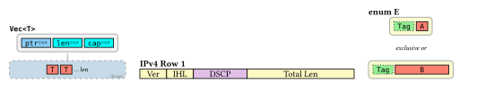

## Quick start

**Nothing to configure — every primitive has a working default.**

```typ
#import "@preview/blockcell:0.1.0": *

#cell[A]  #cell[B]  #cell[C]
#badge[NEW]  #tag[x]
```

**Semantic status? Use the built-in `status` parameter.**

```typ
#badge(status: "success")[OK]
#badge(status: "warning")[WAIT]
#badge(status: "danger")[ERROR]
```

Need the underlying `(fill, stroke)` pair for another component? The original palette form still works:

```typ
#cell(..palettes.status.danger)[Error]
```

**Real use case — domain palettes for structural diagrams.**

```typ
#let C = palettes.rust
#cell(fill: C.ptr)[ptr]
#cell(fill: C.sized)[len]
#cell(fill: C.sized)[cap]
```

Compose those atoms into full structural layouts:

```typ
#let C = palettes.rust

#schema(title: raw("Vec<T>"))[
  #region[
    #cell(fill: C.ptr)[`ptr`#sub-label[2/4/8]]
    #cell(fill: C.sized)[`len`#sub-label[2/4/8]]
    #cell(fill: C.sized)[`cap`#sub-label[2/4/8]]
  ]
  #connector()
  #target(fill: C.heap, label: "(heap)", width: 130pt)[
    #cell(fill: C.any)[`T`]
    #cell(fill: C.any)[`T`]
    #note[… len]
  ]
]
```

## Architecture

The API is organized into three composable layers:

| Layer                    | Purpose                    | Functions                                                                                                            |
| ------------------------ | -------------------------- | -------------------------------------------------------------------------------------------------------------------- |
| **Layer 1 — Atoms**      | Individual visual elements | `cell` `tag` `note` `label` `badge` `sub-label` `span-label` `wrap` `brace` `edge` `flow-node`                       |
| **Layer 2 — Containers** | Grouping and structure     | `region` `target` `connector` `divider` `detail` `entry-list` `stack` `group`                                        |
| **Layer 3 — Composites** | Complete diagram patterns  | `schema` `linked-schema` `grid-row` `lane` `section` `legend` `bit-row` `flex-row` `tier` `match-row` `seq-lane`     |
| **Palettes**             | Curated color sets         | `palettes.base` `palettes.status` `palettes.pastel` `palettes.categorical` `palettes.sequential` (+ domain examples) |

## Layer 1 — Atoms

### `cell` — Colored box

The core building block. A rectangular box with a label, color, and optional decorations.

```typ
#cell(body, fill: palettes.base.surface-strong, width: auto, height: auto,
  stroke: 0.8pt + palettes.base.border, dash: none, radius: 0pt,
  inset: (x: 4pt, y: 2pt), expandable: false,
  phantom: false, overlay: none, baseline: 30%)
```

- `fill`: Background color.
- `stroke`: Border style. Accepts native Typst stroke (e.g. `3pt + red` or `3pt + rgb("#FFD700")`).
- `dash`: Border dash pattern: `none`, `"dashed"`, `"dotted"`.
- `expandable`: Shows `← ⋯ →` markers (indicates variable size).
- `phantom`: Semi-transparent + dashed border (indicates absent / zero-size).
- `overlay`: Top-right overlay marker (e.g. cache state letter).

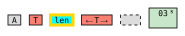

Use `.with()` to create domain-specific helpers:

```typ
#let mc = cell.with(width: 28pt, height: 20pt, inset: 2pt)
#let type-cell(body) = cell(body, fill: rgb("#FA8072"))
#let ptr-field(l: [ptr]) = cell(fill: rgb("#87CEFA"))[#l#sub-label[2/4/8]]
```

### `tag` — Marker cell

A `cell` with a dotted border and light green fill, for enum discriminants or tags.

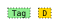

```typ
#tag[`Tag`]
#tag(fill: rgb("#FFD700"))[`D`]
```

### `note` — Inline annotation

Small inline text for "… n times" style annotations.

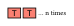

```typ
#cell(fill: rgb("#FA8072"))[`T`]
#cell(fill: rgb("#FA8072"))[`T`]
#note[… n times]
```

### `label` — Muted diagram label

Small muted label text for structural annotations such as section hints,
state notes, or short captions.

```typ
#label[Memory]
#label[(heap)]
#label[Only on eviction]
```

### `badge` — Status indicator

Compact colored badge for states or alerts.

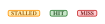

```typ
#badge[STALLED]
#badge(status: "success")[HIT]
#badge(status: "danger")[MISS]
```

Use `status` for the common semantic states:

```typ
#badge(status: "success")[OK]
#badge(status: "warning")[WAIT]
#badge(status: "danger")[ERROR]
#badge(status: "info")[INFO]
#badge(status: "neutral")[SKIP]
```

If you need full control, `badge` still accepts explicit `fill` and `stroke`:

```typ
#badge(fill: rgb("#C8E6C9"), stroke: rgb("#2E7D32"))[HIT]
#badge(fill: rgb("#FFCDD2"), stroke: rgb("#C62828"))[MISS]
```

### `sub-label` — Subscript annotation

Field size annotation, typically used inside a `cell`.

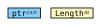

```typ
#cell(fill: rgb("#87CEFA"))[`ptr`#sub-label[2/4/8]]
#cell(fill: rgb("#FFF9C4"))[`Length`#sub-label[2B]]
```

### `span-label` — Extent label

Horizontal span indicator `← label →`.

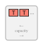

```typ
#region[
  #cell(fill: rgb("#FA8072"))[`T`]
  #cell(fill: rgb("#FA8072"))[`T`]
  #note[…]
  #span-label[capacity]
]
```

### `wrap` — Border wrapper

Adds a thick colored border around content for double-border effects (e.g. Rust's `Cell<T>`).


```typ
#wrap(stroke: 3pt + rgb("#FFD700"))[
  #cell(fill: rgb("#FA8072"))[`T`]   // inner cell keeps its own thin black border
]
```

### `edge` — Directed connector

Inline horizontal arrow with optional label and arrowhead. Express
"A → B" relationships (calls, references, transitions) between sibling
cells in a row.

```typ
#edge(label: none, direction: "right", style: "solid", head: "arrow",
  stroke: 0.8pt + palettes.base.border, length: 24pt)
```

```typ
#cell[Controller] #edge(label: [HTTP]) #cell[Business]
#cell[Business]   #edge(label: [SQL], style: "dashed") #cell[MySQL]
```

- `direction`: `"right"` or `"left"`.
- `style`: `"solid"` / `"dashed"` / `"dotted"`.
- `head`: `"arrow"` (solid triangle) or `"none"`.
- v1 supports horizontal, fixed-length only. Cross-container routing is out
  of scope (use `cetz` / `fletcher` for that).

### `flow-node` — Flowchart node

Rectangle / diamond / stadium / circle node primitive for flowchart-style
diagrams. Combine with `edge` to express conditional branches and process
flows. Three aliases ship for the standard semantics: `process` (rect),
`decision` (diamond), `terminal` (stadium).

```typ
#flow-node(body, shape: "rect", fill: palettes.base.surface,
  stroke: 0.8pt + palettes.base.border, width: auto, height: auto,
  inset: (x: 10pt, y: 6pt))
```

```typ
#process[支付回调到达]
#edge()
#decision(width: 170pt)[state == CLOSED?]
#edge(label: [Yes], stroke: 1pt + red)
#process[恢复 + 退款]
```

- For `diamond`, prefer an explicit `width` (the horizontal diagonal); long
  text otherwise distorts the shape.
- `stadium` (pill) auto-sizes to content; ideal for start/end terminals.

### `brace` — Range marker

Marks a range of elements with a curly brace and a centered label on the
opposite side.

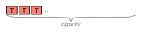

```typ
#brace(body, span: 10em, direction: "down")
```

- `direction`: orientation and which side the label sits on.
  - `"down"` (default): horizontal brace, label below.
  - `"up"`: horizontal brace, label above.
  - `"right"`: vertical brace, label on the right.
  - `"left"`: vertical brace, label on the left.
- `span`: brace 的跨度；横向时表现为宽度，纵向时表现为高度。

```typ
#brace(span: 160pt)[capacity]
#brace(direction: "up",    span: 160pt)[header]
#brace(direction: "right", span: 80pt)[payload]
#brace(direction: "left",  span: 80pt)[prefix]
```

## Layer 2 — Containers

### `region` — Bordered container

Groups multiple cells into a visual unit with a background and border.

```typ
#region(body, fill: palettes.base.surface, stroke: 1pt + palettes.base.border-soft,
  dash: none, radius: 4pt, width: auto, content-align: center,
  label: none, danger: false, faded: false)
```

- `dash`: Border dash pattern (`none`, `"dashed"`, `"dotted"`).
- `label`: Optional bottom-right annotation (e.g. `"(heap)"`).
- `danger`: Thick red border (e.g. unsafe access).
- `faded`: Dashed border, semi-transparent (e.g. zero-size / absent).


```typ
#region[
  #cell(fill: rgb("#87CEFA"))[`ptr`]
  #cell(fill: rgb("#00FFFF"))[`len`]
  #cell(fill: rgb("#00FFFF"))[`cap`]
]
```

### `target` — Referenced region

Dashed-border region with an optional bottom-right label. Represents a linked / referenced area (heap, static, etc.). Thin wrapper over `region` with `dash: "dashed"` and a transparentized fill.

```typ
#target(body, fill: rgb("#FDECDC"), label: none, width: auto)
```

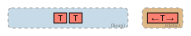

```typ
#target(fill: rgb("#C6DBE7"), label: "(heap)", width: 120pt)[
  #cell(fill: rgb("#FA8072"))[`T`]
  #cell(fill: rgb("#FA8072"))[`T`]
]
```

### `connector` — Vertical line

Links a region to its target.

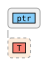

```typ
#connector(length: 8pt, stroke: 1pt + palettes.base.border-soft)
```

### `group` — Logical-grouping frame

A bordered container with a top-left title for grouping multiple independent
sub-components into a logical boundary. Sits between `region` (single
structural unit) and `section` (document-level card).

```typ
#group(body, label: none, fill: palettes.base.surface,
  stroke: 0.5pt + palettes.base.border-soft, dash: none,
  radius: 6pt, width: auto, inset: 10pt)
```

```typ
#group(label: [业务层 Business], fill: palettes.categorical.at(1).lighten(40%))[
  #region(fill: palettes.categorical.at(1))[Business: 自有平台]
  #v(4pt)
  #region(fill: palettes.categorical.at(1).lighten(10%))[Business: 外部平台同步]
]
```

- `dash: "dashed"` marks a logical (non-physical) boundary.
- Nestable; pick `fill` shades to convey hierarchy.

### `stack` — Vertical stack

A simple vertical stack for diagram fragments. Pass each stacked item as its
own content block to keep item boundaries explicit and avoid repeated `#v(...)`
calls or a one-column `grid`.

```typ
#align(center)[
  #stack(
    [#region(fill: palettes.cache.l1.lighten(40%), width: 120pt)[
      #text(weight: "bold")[L1 Cache]
    ]],
    [#region(fill: palettes.cache.l2.lighten(40%), width: 160pt)[
      #text(weight: "bold")[L2 Cache]
    ]],
    [#region(fill: palettes.cache.l3.lighten(40%), width: 200pt)[
      #text(weight: "bold")[L3 Cache]
    ]],
  )
]
```

### `divider` — Text separator

Separates layout alternatives (e.g. enum variants).

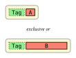

```typ
#divider(body: [exclusive or])
```

### `detail` — Explanation bar

An explanation bar below a region.

```typ
#detail[Runtime borrow count tracked here.]
```

### `entry-list` — Vertical entry list

A vertical list of labeled entries inside a target (vtables, register maps, etc.).

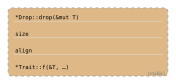

```typ
#entry-list(
  label: "(vtable)",
  ([`*Drop::drop(&mut T)`], [`size`], [`align`], [`*Trait::f(&T, …)`]),
)
```

## Layer 3 — Composites

### `schema` — Diagram container

Top-level inline container with a title and description. Multiple `schema` blocks placed adjacent flow horizontally.

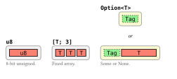

```typ
#schema(title: raw("u8"), desc: [8-bit unsigned.])[
  #region[#cell(fill: rgb("#FA8072"), width: 40pt)[`u8`]]
]#schema(title: raw("[T; 3]"), desc: [Fixed array.])[
  #region[
    #cell(fill: rgb("#FA8072"))[`T`]
    #cell(fill: rgb("#FA8072"))[`T`]
    #cell(fill: rgb("#FA8072"))[`T`]
  ]
]
```

### `linked-schema` — Fields + connector + target

The most common pattern: a top-level field region linked to a target region below.

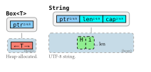

```typ
#linked-schema(
  title: raw("Box<T>"),
  desc: [Heap-allocated.],
  fields: (cell(fill: rgb("#87CEFA"))[`ptr`#sub-label[2/4/8]],),
  target-fill: rgb("#C6DBE7"),
  target-label: "(heap)",
  cell(fill: rgb("#FA8072"), expandable: true)[`T`],
)
```

### `grid-row` — Labeled row

A labeled row of cells for tabular, register, or cache diagrams. The label is vertically centered.


```typ
#grid-row(label: [Main Memory], label-width: 80pt)[
  #cell(fill: rgb("#FFE0B2"), width: 28pt, height: 20pt, inset: 2pt)[`03`]
  #cell(fill: rgb("#FFE0B2"), width: 28pt, height: 20pt, inset: 2pt)[`21`]
]
```

### `lane` — Horizontal track

Color-coded items on a horizontal track for thread or pipeline visualization.

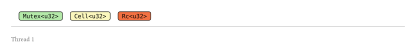

```typ
#lane(
  name: [Thread 1],
  items: (
    (label: [`Mutex<u32>`], fill: rgb("#B4E9A9")),
    (label: [`Cell<u32>`],  fill: rgb("#FBF7BD")),
    (label: [`Rc<u32>`],    fill: rgb("#F37142")),
  ),
)
```

### `seq-lane` — Sequence diagram

Declarative two-axis layout for "calls between participants" — the heavier
counterpart to `lane`'s "states over time" track. Participants are columns
(with header cards and dashed lifelines); steps cover the standard UML
vocabulary built with the `seq-*` constructors:

| Constructor                   | What it renders                                                   |
| ----------------------------- | ----------------------------------------------------------------- |
| `seq-call(from, to)[label]`   | Sync call (solid + filled triangle). Self-loop when `from == to`. |
| `seq-ret(from, to)[label]`    | Return (dashed + open V head).                                    |
| `seq-note(over)[label]`       | Sticky-note. `over` is one id or a 2-tuple to span columns.       |
| `seq-act(who)[label]`         | Action block in one column.                                       |
| `seq-alt(condition, ..steps)` | Alt fragment. `seq-opt` / `seq-loop` / `seq-par` work the same.   |

```typ
#seq-lane(
  seq-call("client", "biz")[POST /order/create],
  seq-note("biz")[校验库存与黑名单],
  seq-alt([validation passed],
    seq-call("biz", "ganon")[POST /lock],
    seq-ret("ganon", "biz")[200 OK],
    seq-call("biz", "db")[INSERT 事务],
    seq-ret("db", "biz")[OK],
  ),
  seq-ret("biz", "client")[201 Created],
)
```

- Participants are auto-derived from the step IDs in first-appearance order,
  with default colors from `palettes.categorical`. Pass `participants: ((id:
"biz", name: [Business], fill: my-color), …)` to override display name or
  color per id.
- Activation rectangles (focus of control) are auto-derived from call/return
  pairs and tinted to match each participant. `activate: false` disables, or
  `activation-width: <length>` adjusts width.
- Arrow heads differ by step type: filled triangle for `seq-call`, open V
  for `seq-ret`.
- Fragments nest naturally as nested function calls — no manual `start` /
  `end` markers, no mismatch bugs.
- Notes are rendered as folded sticky-note shapes.

### `section` — Titled card

A titled card container for grouping related diagrams.

```typ
#section[Cache Coherency][
  // diagrams go here
]
```

### `legend` — Color legend

One-line color legend mapping fills to labels.

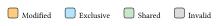

```typ
#legend(
  (label: [Modified], fill: orange),
  (label: [Shared],   fill: green),
  (label: [Invalid],  fill: gray),
)
```

### `bit-row` — Proportional bit-field row

Fields scale proportionally by bit count. Designed for protocol headers and register maps.

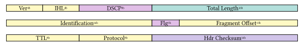

```typ
#bit-row(total: 32, width: 400pt, fields: (
  (bits: 4,  label: [Ver],          fill: yellow),
  (bits: 4,  label: [IHL],          fill: yellow),
  (bits: 8,  label: [DSCP],         fill: purple),
  (bits: 16, label: [Total Length], fill: aqua),
))
```

- `total`: Total bit width of the row (e.g. 32).
- `width`: Total visual width.
- `fields`: Array of `(bits, label, fill)` dictionaries. Optional keys: `stroke`, `dash`.
- `show-bits`: Show bit widths as subscript (default: `true`).

### `flex-row` — Proportional column widths

Distributes available width across cells by `flex` ratios (Typst `fr` units), so
you don't have to hand-tune `width: NNpt` on every cell. Pass each item as a
`(flex:, body:)` dictionary; the column's width is `flex / sum(flex) * row-width`.

```typ
#flex-row(width: auto, gap: 0pt, align: horizon, ..items)
```

```typ
// Before — every column needs an explicit width
#grid-row(label: [Catalog])[
  #cell(fill: blue,  width: 90pt)[Category Tree]
  #cell(fill: aqua,  width: 90pt)[Product Card]
  #cell(fill: teal,  width: 180pt)[Search Index]
]

// After — flex-row distributes width by ratio
#grid-row(label: [Catalog])[
  #flex-row(
    (flex: 1, body: cell(fill: blue,  width: 100%)[Category Tree]),
    (flex: 1, body: cell(fill: aqua,  width: 100%)[Product Card]),
    (flex: 2, body: cell(fill: teal,  width: 100%)[Search Index]),
  )
]
```

- Children with `width: auto` (the default) keep their intrinsic size inside
  the assigned column. Set `width: 100%` on the child to fill the column.
- `width: auto` makes the row fill its parent; pass an explicit length to fix it.

## Usage Patterns

### Use a built-in palette

The package ships with several palettes under the `palettes` namespace,
organized by _visual role_ rather than subject domain:

#### `palettes.status` — semantic states

Each state is a `(fill, stroke)` pair you spread directly into any
function that accepts those arguments — one concept, one access:

```typ
#badge(..palettes.status.success)[OK]
#badge(..palettes.status.danger)[ERROR]
#cell(..palettes.status.warning)[Check me]
```

Need the dark tone for text? Use `.stroke`:

```typ
#text(fill: palettes.status.info.stroke)[note]
```

Keys: `success` `warning` `danger` `info` `neutral` — each a `(fill:, stroke:)` dict.

#### `palettes.pastel` — named soft swatches

A general-purpose base. Use when you just want "a nice blue".

```typ
#cell(fill: palettes.pastel.blue)[Inbox]
#cell(fill: palettes.pastel.green)[Approved]
```

Keys: `red` `pink` `purple` `indigo` `blue` `cyan` `teal` `green` `lime` `yellow` `orange` `brown` `gray`.

#### `palettes.categorical` — 8 colors for N groups

An **array** of 8 harmonious but distinguishable colors. Ideal for legends
or series where you just need "the next distinct color".

```typ
#for (i, label) in ([Alpha], [Beta], [Gamma]).enumerate() {
  cell(fill: palettes.categorical.at(i))[#label]
}
```

#### `palettes.sequential` — intensity ramps

Light → dark single-hue ramps (5 steps). Use for levels, priority, heatmap-like coding.

```typ
#for lvl in range(5) {
  cell(fill: palettes.sequential.blue.at(lvl))[L#lvl]
}
```

Ramps: `blue`, `green`, `orange`, `purple`, `gray`.

#### Domain examples

`palettes.rust`, `palettes.network`, `palettes.cache` are the exact palettes
used by the bundled examples. Treat them as starting points — copy, rename,
or ignore entirely.

### Tweak or extend a palette

Spread into a new dict to override or add keys:

```typ
#let C = (..palettes.pastel, accent: rgb("#FF6F00"))
#cell(fill: C.accent)[Highlight]
```

### Define a custom palette

When the built-ins don't fit, a palette is just a dict of colors:

```typ
#let C = (
  header: rgb("#BBDEFB"), addr: rgb("#B2DFDB"),
  flag: rgb("#E1BEE7"), data: rgb("#DCEDC8"),
)
```

### Create helpers with `.with()`

Avoid repeating arguments:

```typ
#let mc = cell.with(width: 28pt, height: 20pt, inset: 2pt)
#let tc(body, ..args) = cell(body, fill: C.any, ..args)
#let ptr-field(l: [ptr]) = cell(fill: C.ptr)[#l#sub-label[2/4/8]]
```

### Horizontal layout

`schema` is an inline box. Place multiple `schema` blocks adjacent (no blank line between them) to flow horizontally:

```typ
#schema(title: [A])[...
]#schema(title: [B])[...    // ← immediately after the closing bracket
]#schema(title: [C])[...
]
```

If descriptions cause overflow, constrain with `width`:

```typ
#linked-schema(
  width: 160pt,
  desc: [A longer description wraps within this width.],
  // ... other arguments
)
```
