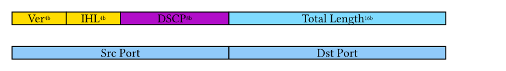
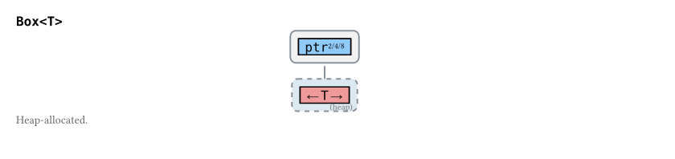
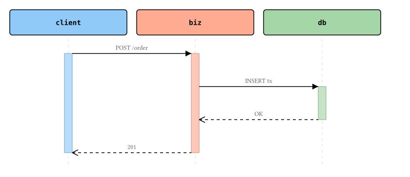
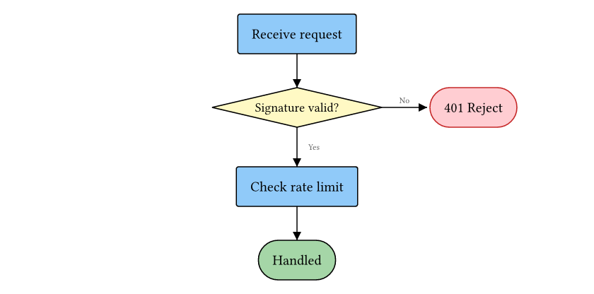
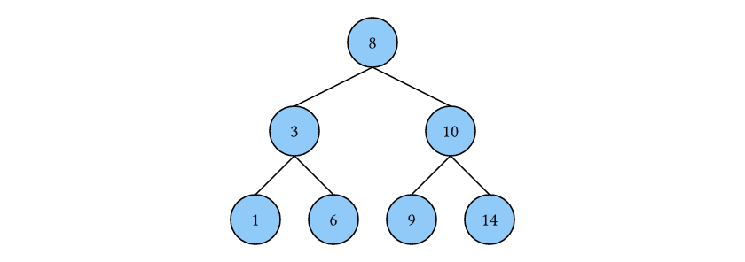

# Blockcell

Composable block-and-cell diagrams for Typst — write structured technical diagrams (memory layouts, protocol headers, flowcharts, state machines, sequence and tree diagrams) directly in your document, with a single set of primitives.

## Highlights

- **One library, many diagram families.** Bit fields, structural figures, flowcharts, state machines, sequence and tree diagrams all share the same atoms (`cell`, `region`, `edge`) and palette system.
- **Three-layer API.** Atoms compose into containers, containers compose into ready-made figures (`schema`, `bit-row`, `flow-col`, `state-chain`, `seq-lane`, `tree`). Pick the layer that matches your need.
- **PlantUML-compatible sequence layer.** `seq-lane` covers UML sequence vocabulary (calls, returns, fragments, lifelines, autonumber, swim lanes); `seq-puml` accepts PlantUML source verbatim.
- **Stable, document-friendly visuals.** Built-in `palettes.status` / `pastel` / `categorical` / `sequential` / domain palettes (`rust`, `network`, `cache`) keep figures consistent across a document.
- **Snapshot-tested.** Every composite ships with a reference PNG so visual regressions are caught early.

## Showcase

| Bit fields & headers | Heap-allocated structures |
| --- | --- |
|  |  |

| Sequence diagrams | State machines |
| --- | --- |
|  |  |

| Flowcharts | Hierarchical trees |
| --- | --- |
|  |  |

All six are produced by the snapshot tests in `tests/`; see `examples/` for full standalone files.

## Install

```typst
#import "@preview/blockcell:0.1.0": *

#cell[Loaded]
```

## A real example

```typst
#import "@preview/blockcell:0.1.0": *

#let C = palettes.rust

#schema(title: raw("Vec<T>"))[
  #region[
    #cell(fill: C.ptr)[`ptr`#sub-label[2/4/8]]
    #cell(fill: C.sized)[`len`#sub-label[2/4/8]]
    #cell(fill: C.sized)[`cap`#sub-label[2/4/8]]
  ]
  #connector()
  #target(fill: C.heap, label: "(heap)", width: 130pt)[
    #cell(fill: C.any)[`T`]
    #cell(fill: C.any)[`T`]
    #note[… len]
  ]
]
```

## API at a glance

| Layer                | Purpose                 | Examples                                         |
| -------------------- | ----------------------- | ------------------------------------------------ |
| Layer 1 — Atoms      | Small visual elements   | `cell`, `tag`, `badge`, `note`, `edge`           |
| Layer 2 — Containers | Grouping and structure  | `region`, `target`, `group`, `stack`             |
| Layer 3 — Composites | Common diagram patterns | `schema`, `linked-schema`, `bit-row`, `seq-lane` |

Specialized chapters: `flow-col` / `branch` / `switch` / `flow-loop` for flowcharts, `state-chain` / `state` / `loop` / `jump` for state machines, `tree` / `node` for hierarchies, `seq-lane` / `seq-call` / `seq-ret` / fragments for sequences.

## Built-in palettes

- `palettes.status` — semantic status (success / warning / danger / info / neutral)
- `palettes.pastel` — general-purpose soft colors
- `palettes.categorical` — distinct colors for groups
- `palettes.sequential` — same-hue intensity ramps
- `palettes.rust` / `palettes.network` / `palettes.cache` — domain palettes used by the examples

## Documentation & examples

- Full manual: [`docs/manual.typ`](docs/manual.typ) (compile with `typst compile --root . docs/manual.typ`)
- Scenario examples: [`examples/README.md`](examples/README.md)
- Snapshot tests: [`tests/README.md`](tests/README.md)

Suggested starting examples:

- `examples/rust-cells.typ` — memory layout & ownership
- `examples/network-layers.typ` — protocol headers
- `examples/http-handler-flow.typ` — request-processing flow
- `examples/file-io-states.typ` — state machine
- `examples/cache-hierarchy.typ` — aligned hierarchy with legend

## When to use it

Reach for `blockcell` when you want structured, composable, document-friendly figures with consistent styling. If you instead need freeform canvas placement, dense 2D routing, or general illustration, pair it with — or use — `cetz` / `fletcher`.

## License

MIT
